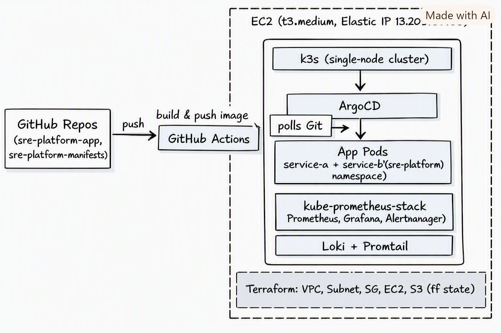

# Self-Healing Observable Platform

One-line pitch: Designed and operated a GitOps-deployed microservice
platform on AWS with full observability, defined SLOs, and chaos-tested
incident response.

## Architecture

> Part of a 4-repo GitOps setup. See [sre-platform](https://github.com/Tamal-tm/sre-platform)
> for the full architecture, infra setup, and end-to-end demo.

## What's in here
- Terraform-provisioned AWS infra (VPC, EC2, Elastic IP, S3 remote state)
- k3s single-node Kubernetes cluster
- ArgoCD GitOps deployment (3-repo split: infra / app / manifests)
- Two-service demo app (Node/Express + Python/Flask) with Prometheus instrumentation
- kube-prometheus-stack (Prometheus, Grafana, Alertmanager) + Loki/Promtail
- A defined SLO with error-budget burn-rate alerting to Slack
- Chaos-tested: pod-kill and CPU-stress experiments with a full blameless postmortem

## SLO
99% of requests succeed with <300ms latency, rolling 7-day window
→ full detail in [SLO.md](./SLO.md)

## Chaos engineering & postmortem
See [docs/postmortem-chaos-day4.md](./docs/postmortem-chaos-day4.md) for the
full writeup, including timeline, evidence screenshots, and action items —
including a real gap found in SLO alert coverage (latency wasn't being
monitored, only error rate).

## Setup instructions
1. `terraform apply` in the `sre-platform` repo — provisions VPC, EC2,
   Elastic IP, and S3 backend for remote state.
2. k3s is bootstrapped via `user_data.sh` on instance launch.
3. SSH into the instance, install ArgoCD, point it at the
   `sre-platform-manifests` repo's `base/` path with auto-sync enabled.
4. Install the monitoring stack:
   `helm install monitoring prometheus-community/kube-prometheus-stack -n monitoring --create-namespace`
5. Push to `main` in `sre-platform-app` → GitHub Actions builds and pushes
   the image → bumps the tag in `sre-platform-manifests` → ArgoCD detects
   the Git change and deploys. CI never touches the cluster directly.

## Cost breakdown (ap-south-1, approximate)
| Resource | Running 24/7 | Stopped when not demoing |
|---|---|---|
| EC2 t3.medium | ~$33/month | $0 compute |
| EBS volume | ~$2.40/month (30GB) | same, persists regardless |
| Elastic IP (attached to running instance) | Free | N/A |
| Elastic IP (attached to stopped instance) | — | ~$3.65/month (AWS bills idle/stopped-instance EIPs) |
| S3 (tf state) | Negligible | same |

Realistic monthly cost for occasional demos with the instance stopped
between sessions: roughly **$5-10/month**.

## Design tradeoffs (worth reading before an interview)
- **Single-node k3s cluster instead of multi-node HA** — deliberate cost
  decision. This means a node-level failure (or, as found during chaos
  testing, any CPU-heavy workload on the node) affects every component
  sharing it, since there's no second node to isolate or redistribute load
  onto. See the postmortem for the full finding.
- **3-repo GitOps split** (infra / app / manifests) instead of a monorepo —
  mirrors how CI (build+push) and CD (Argo sync) stay decoupled in real
  GitOps setups; CI never touches the cluster directly.
